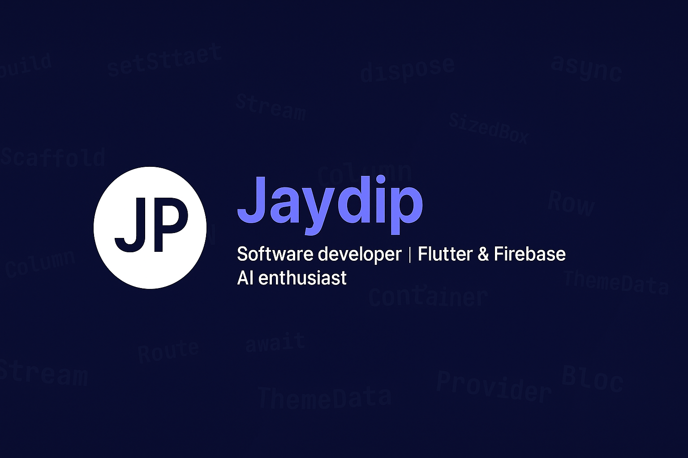

  <!-- Banner -->
  

 

<h1 align="center">Hi 👋, I'm Jaydip</h1>

  <b>Software Developer</b> | <b>Flutter & Firebase</b> | <b>AI Enthusiast</b>

---

### 🔥 About Me
- 🚀 Building apps with **Flutter** & **Firebase**
- 🤖 Exploring **AI-powered apps** and integrations
- 🛠 Passionate about creating scalable & modern UI/UX
- 🎯 Open to **remote dev roles** and **collaborations**

---

## 🚀 Projects

### 🔹 [Cambay Gemmological Lab (CGL)](https://github.com/jaydiprpatel/cgl-app)
Certificate management app built with **Flutter + Firebase**  
- Dynamic PDF certificate generation  
- Multi-platform (Windows, Web)  
- QR code verification system  

---

### 🔹 [KeshKart](https://github.com/jaydiprpatel/keshkart-app)
Barber service & grooming app  
- Firebase Authentication & Firestore  
- Dual dashboards (Barber / Customer)  
- Grooming products with recommendations  

---

### 🔹 [SmartBytes](https://github.com/jaydiprpatel/smartbytes)
AI-powered notes app  
- GPT-4o Mini integration for querying notes  
- Expense tracking & summaries  
- Clean Provider-based architecture  

---

### 🔹 [Portfolio Website](https://github.com/jaydiprpatel/portfolio)
My personal portfolio site  
- Built in **Flutter Web**  
- Responsive design with animated background  
- Scroll-to-reveal projects
 

---

### 📊 GitHub Stats

  
  

---

### 🌐 Connect

  

